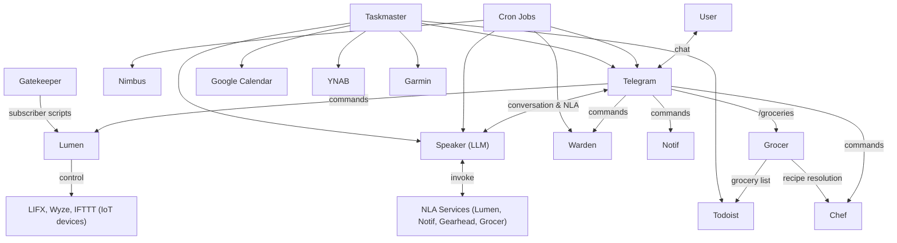

# DImROD Services

DImROD consists of 13 Python-based microservices, each running as a systemd service. Services communicate via authenticated HTTP/JSON APIs using the [Oracle](../library.md#oraclepy--http-api-server) framework.

## Service Overview

| Service | Purpose | Oracle API | NLA |
|---------|---------|:----------:|:---:|
| [Speaker](speaker.md) | LLM dialogue engine and NLA dispatcher | ✓ | — |
| [Telegram](telegram.md) | Telegram bot — primary user interface | ✓ | — |
| [Lumen](lumen.md) | Smart home lighting control | ✓ | ✓ |
| [Warden](warden.md) | Network device monitoring | ✓ | — |
| [Notif](notif.md) | Reminder scheduling and delivery | ✓ | ✓ |
| [Nimbus](nimbus.md) | Weather forecasts (US NWS API) | ✓ | — |
| [Chef](chef.md) | Recipe registry and search | ✓ | — |
| [Grocer](grocer.md) | Grocery list management (Todoist) | ✓ | ✓ |
| [Gatekeeper](gatekeeper.md) | Event routing and subscriber dispatch | ✓ | — |
| [Historian](historian.md) | Event archival (SQLite) | ✓ | — |
| [Gearhead](gearhead.md) | Vehicle & mileage tracking | ✓ | ✓ |
| [Taskmaster](taskmaster.md) | Automated recurring job scheduler | — | — |
| [Rambler](rambler.md) | Flight price scraper | — | — |

## Communication Patterns

### Inter-Service Communication

Services communicate via `OracleSession`, an HTTP client that authenticates with JWT cookies and makes JSON API calls. See [Running and Debugging](../running-and-debugging.md) for configuration details.

### NLA (Natural Language Actions)

Services that expose NLA endpoints (currently Lumen, Notif, Gearhead, and Grocer) register their capabilities with the Oracle. Speaker discovers these at runtime and dispatches natural-language requests to the appropriate service. See the [NLA types documentation](../data-types.md#nla-types) for details.
