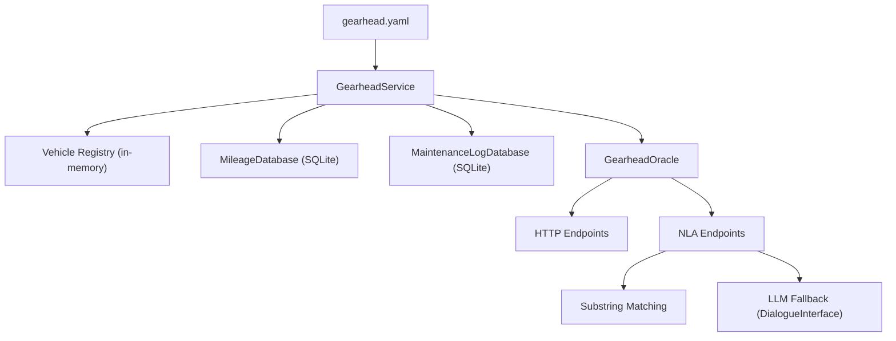

# Gearhead — Vehicle & Mileage Tracker

Gearhead tracks vehicle definitions and mileage readings for the DImROD operator. Vehicles are defined in the service config, and mileage entries are persisted to a SQLite database over time.

## Purpose

* Maintain a config-driven registry of vehicles (manufacturer, year, VIN, properties, etc.)
* Record and retrieve timestamped mileage (odometer) readings in a SQLite database
* Expose Oracle HTTP endpoints for programmatic vehicle and mileage queries
* Expose NLA endpoints so Speaker/Telegram can interact with Gearhead via natural language
* Use two-tier vehicle matching (substring first, LLM fallback) for natural language requests

## Architecture

Gearhead follows the standard DImROD Service + Oracle pattern:

* `GearheadService` loads vehicle definitions from config and initializes the `MileageDatabase` and `MaintenanceLogDatabase`
* `GearheadOracle` exposes HTTP and NLA endpoints
* `MileageDatabase` wraps `lib/db.py`'s `Database` class for mileage-specific persistence
* `MaintenanceLogDatabase` wraps `lib/db.py`'s `Database` class for maintenance log persistence (one table per vehicle)



On startup, the service:

1. Parses the config file into `GearheadConfig`
2. Loads all vehicle definitions and validates that IDs are unique
3. Initializes the `MileageDatabase` with the configured database path
4. Initializes the `MaintenanceLogDatabase` with the configured database path

The service itself has no background worker loop — all functionality is exposed through the Oracle.

## Vehicle Data Models

All data models are defined in `vehicle.py` and follow the DImROD [Uniserdes](../library.md#uniserdespy--data-serialization) pattern.

**ID Sanitization:** Both `Vehicle` and `MaintenanceTask` perform ID sanitization in `post_parse_init()`: leading/trailing whitespace is stripped, and internal whitespace causes a `ValueError` at startup. This ensures IDs are safe for SQLite table names, regex parsing, and URL parameters.

### `MaintenanceTask`

Defines a recurring maintenance task for a vehicle, triggered by mileage thresholds and/or datetime triggers. A task must have at least one trigger mechanism defined (`mileages` or `datetimes`).

| Field | Type | Required | Default | Description |
|-------|------|----------|---------|-------------|
| `id` | `str` | Yes | — | Unique task identifier (e.g., `"oil_change"`) |
| `name` | `str` | Yes | — | Human-readable task name (e.g., `"Oil Change"`) |
| `description` | `str` | No | `""` | Optional description of the task. Supports the universal [string preprocessor](../data-types.md#universal-string-preprocessing): use the `!file` bang command to load description text from an external file (e.g., `!file ./descriptions/oil_change.txt`), or use environment variables with `$VAR` syntax. |
| `mileages` | `list[int/float]` | No | `[]` | Mileage thresholds at which the task should be performed (e.g., `[5000, 10000, 15000]`) |
| `datetimes` | `list[DatetimeTrigger]` | No | `[]` | Time-based triggers for when the task should be performed (see [DatetimeTrigger](../data-types.md#datetimetrigger)) |

**Validation:** At least one of `mileages` or `datetimes` must be non-empty. A task with both represents maintenance due by whichever condition is met first (OR logic).

### `VehicleProperty`

A generic key-value property for open-ended vehicle metadata. All vehicle attributes — including engine details like horsepower, displacement, and fuel type — are represented as properties.

| Field | Type | Required | Default | Description |
|-------|------|----------|---------|-------------|
| `key` | `str` | Yes | — | Property key (e.g., `"color"`, `"horsepower"`) |
| `nickname` | `str` | No | `""` | Human-readable name (e.g., `"Exterior Color"`) |
| `value` | `str`, `int`, or `float` | Yes | — | Property value (supports string, integer, and float types) |

### `Vehicle`

The main vehicle model, parsed from config YAML entries.

| Field | Type | Required | Default | Description |
|-------|------|----------|---------|-------------|
| `id` | `str` | Yes | — | Unique identifier (e.g., `"civic_2020"`) |
| `manufacturer` | `str` | Yes | — | Vehicle manufacturer (e.g., `"Honda"`) |
| `year` | `int` | Yes | — | Model year |
| `nicknames` | `list[str]` | No | `[]` | Human-friendly names (e.g., `["The Daily Driver", "The Civic"]`) |
| `vin` | `str` | No | `""` | Vehicle Identification Number |
| `license_plate` | `str` | No | `""` | License plate number |
| `properties` | `list[VehicleProperty]` | No | `[]` | Open-ended key-value properties (including engine details) |
| `maintenance_tasks` | `list[MaintenanceTask]` | No | `[]` | Recurring maintenance tasks with mileage thresholds |

## Mileage Tracking

Mileage tracking is defined in `mileage.py`. Entries are stored in a SQLite database managed by the `MileageDatabase` class.

### `MileageEntry`

A timestamped odometer reading for a vehicle. Entry IDs are SHA-256 hashes generated from the vehicle ID and timestamp, ensuring uniqueness and stability.

| Field | Type | Required | Default | Description |
|-------|------|----------|---------|-------------|
| `id` | `str` | No | `None` | SHA-256 hash of `vehicle_id` + `timestamp` (auto-generated) |
| `vehicle_id` | `str` | Yes | — | References a `Vehicle.id` |
| `mileage` | `float` | Yes | — | Odometer reading |
| `timestamp` | `datetime` | Yes | — | When the reading was taken |

All four fields are kept visible in the SQLite table (via `sqlite3_fields_to_keep_visible()`) so queries can filter by `vehicle_id` and order by `timestamp` without decoding the Uniserdes blob.

### `MileageDatabase`

Wraps `lib/db.py`'s `Database` class to provide mileage-specific operations. The table is auto-created on first write.

| Method | Description |
|--------|-------------|
| `save(entry)` | Insert or replace a `MileageEntry` in the database |
| `search_latest(vehicle_id)` | Return the most recent mileage entry for a vehicle |
| `search_history(vehicle_id, time_start, time_end)` | Return mileage entries for a vehicle, optionally filtered by date range |

`search_latest()` uses `order_by="timestamp"` with `desc=True` and `limit=1` to efficiently retrieve only the most recent reading. `search_history()` uses the same ordering without a limit, and optionally filters by Unix epoch timestamp range.

### `MileageDatabaseConfig`

Extends `DatabaseConfig` from `lib/db.py`, inheriting the `path` field. No additional fields are defined, but the extension point allows Gearhead-specific database config to be added in the future.

| Field | Type | Required | Description |
|-------|------|----------|-------------|
| `path` | `str` | Yes | Path to the SQLite database file |

## Maintenance Log

The maintenance log subsystem provides persistent state for tracking when maintenance tasks are created (pending) and completed (done). It is defined in `maintenance_log.py`.

### `MaintenanceLogEntryStatus`

An enum representing the status of a maintenance log entry.

| Value | Name | Description |
|-------|------|-------------|
| `0` | `PENDING` | A Todoist task has been created; user has not yet completed it |
| `1` | `DONE` | The maintenance has been completed |

Status transitions are **append-only** — a new entry is created rather than updating an existing one, providing a full audit trail.

### `MaintenanceLogEntry`

Represents a single maintenance log entry. Entry IDs are SHA-256 hashes generated from vehicle_id, task_id, trigger_key, status value, and timestamp.

| Field | Type | Required | Default | Description |
|-------|------|----------|---------|-------------|
| `id` | `str` | No | `None` | SHA-256 hash (auto-generated via `get_id()`) |
| `vehicle_id` | `str` | Yes | — | References a `Vehicle.id` |
| `task_id` | `str` | Yes | — | References a `MaintenanceTask.id` |
| `status` | `MaintenanceLogEntryStatus` | Yes | — | PENDING (0) or DONE (1) |
| `trigger_key` | `str` | Yes | — | Identifies the specific trigger occurrence (e.g., `"mileage:45000"`) |
| `mileage` | `float` | Yes | — | Vehicle mileage at time of entry creation |
| `timestamp` | `datetime` | Yes | — | UTC datetime when this entry was created |
| `todoist_task_id` | `str` | No | `""` | The Todoist task ID for completion detection |
| `notes` | `str` | No | `""` | Free-text notes |

#### Trigger Key Format

Trigger keys identify specific trigger occurrences and are generated via static methods:

* **Mileage:** `MaintenanceLogEntry.make_mileage_trigger_key(threshold)` → `"mileage:45000"`
* **Datetime:** `MaintenanceLogEntry.make_datetime_trigger_key(date)` → `"datetime:2025-07"`

#### Metadata Footer

Todoist task descriptions include a machine-readable metadata footer for reliable parsing:

```
[dimrod::vehicle_maintenance vehicle=focus_st_2018 task=oil_change trigger="mileage:45000"]
```

Parsed via `MAINTENANCE_METADATA_PATTERN` regex and `parse_maintenance_metadata()` function.

### `MaintenanceLogDatabase`

Uses a single shared SQLite database file with **one table per vehicle**. Table names follow the convention `log_{vehicle_id}`.

| Method | Description |
|--------|-------------|
| `save(entry)` | Insert or replace a `MaintenanceLogEntry` |
| `search_by_task(vehicle_id, task_id, status, limit)` | Query by task ID with optional status filter |
| `search_by_trigger(vehicle_id, task_id, trigger_key)` | Core dedup query — find entries for a specific trigger |
| `search_by_status(vehicle_id, status)` | Filter entries by status |
| `search_all_pending_with_todoist_id(vehicle_ids)` | All pending entries with Todoist IDs across vehicles |
| `search_by_mileage_range(vehicle_id, start, end)` | Filter by mileage range (inclusive) |
| `search_by_date_range(vehicle_id, start, end)` | Filter by date range (inclusive) |
| `search_latest_by_task(vehicle_id, task_id)` | Most recent entry for a task |

### `MaintenanceLogDatabaseConfig`

Extends `DatabaseConfig` from `lib/db.py`, inheriting the `path` field.

| Field | Type | Required | Description |
|-------|------|----------|-------------|
| `path` | `str` | Yes | Path to the maintenance log SQLite database file |

## Configuration

`GearheadConfig` extends `ServiceConfig` with the following additional fields:

| Field | Type | Required | Default | Description |
|-------|------|----------|---------|-------------|
| `vehicles` | `list[Vehicle]` | Yes | — | Vehicle definitions |
| `mileage_db` | `MileageDatabaseConfig` | Yes | — | Mileage database settings |
| `maintenance_log_db` | `MaintenanceLogDatabaseConfig` | Yes | — | Maintenance log database settings |
| `dialogue` | `DialogueConfig` | No | `None` | OpenAI settings for LLM-assisted vehicle matching |

The `dialogue` field is optional. When omitted, the NLA vehicle matching uses only substring matching (tier 1). When provided, failed substring matches fall back to an LLM oneshot query (tier 2).

### Example Config

```yaml
service_name: gearhead
service_log: stdout
msghub_name: YOUR_MSGHUB_NAME
oracle:
  addr: 0.0.0.0
  port: 2363
  log: stdout
  auth_cookie: gearhead_auth
  auth_secret: YOUR_JWT_SECRET_HERE
  auth_users:
  - username: torque
    password: wrench
    privilege: 0

mileage_db:
  path: ./.gearhead.db

maintenance_log_db:
  path: ./.gearhead_maintenance_log.db

dialogue:
  openai_api_key: YOUR_OPENAI_KEY_HERE
  openai_chat_model: gpt-4o-mini

vehicles:
- id: civic_2020
  manufacturer: Honda
  year: 2020
  nicknames:
  - The Daily Driver
  - The Civic
  vin: 1HGBH41JXMN109186
  license_plate: ABC-1234
  properties:
  - key: engine_type
    nickname: Engine Type
    value: gasoline
  - key: horsepower
    nickname: Horsepower
    value: 158
  - key: oil_capacity
    nickname: Oil Capacity (quarts)
    value: 3.7
  - key: cylinders
    nickname: Cylinders
    value: 4
  - key: displacement
    nickname: Displacement (liters)
    value: 2.0
  - key: color
    nickname: Exterior Color
    value: Lunar Silver Metallic
  - key: trim
    nickname: Trim Level
    value: EX
  maintenance_tasks:
  - id: oil_change
    name: Oil Change
    description: Change engine oil and filter
    mileages: [5000, 10000, 15000, 20000, 25000, 30000, 35000, 40000, 45000, 50000]
  - id: tire_rotation
    name: Tire Rotation
    description: Rotate tires for even wear
    mileages: [7500, 15000, 22500, 30000, 37500, 45000]
  - id: brake_inspection
    name: Brake Inspection
    description: Inspect brake pads and rotors
    mileages: [15000, 30000, 45000, 60000]

- id: model3_2022
  manufacturer: Tesla
  year: 2022
  nicknames:
  - Sparky
  vin: 5YJ3E1EA1NF123456
  license_plate: EV-5678
  properties:
  - key: engine_type
    nickname: Engine Type
    value: electric
  - key: horsepower
    nickname: Horsepower
    value: 283
  - key: range_miles
    nickname: EPA Range
    value: 358
  - key: color
    nickname: Exterior Color
    value: Pearl White
  maintenance_tasks:
  - id: tire_rotation
    name: Tire Rotation
    description: Rotate tires for even wear
    mileages: [7500, 15000, 22500, 30000, 37500, 45000]
  - id: cabin_air_filter
    name: Cabin Air Filter
    description: Replace cabin air filter
    mileages: [25000, 50000, 75000, 100000]
  - id: brake_fluid
    name: Brake Fluid Check
    description: Check and replace brake fluid
    mileages: [25000, 50000, 75000, 100000]
```

## Oracle Endpoints

### `GET /vehicles`

Returns all configured vehicles.

* **Authentication:** Required
* **Request body:** None
* **Response:** JSON array of vehicle objects

### `GET /vehicle`

Returns a single vehicle by its ID.

* **Authentication:** Required
* **Request fields:**

| Field | Required | Description |
|-------|----------|-------------|
| `id` | Yes | Vehicle identifier string |

* **Response:** JSON vehicle object, or 404 if not found

### `GET /mileage`

Returns the latest (most recent) mileage reading for a vehicle.

* **Authentication:** Required
* **Request fields:**

| Field | Required | Description |
|-------|----------|-------------|
| `vehicle_id` | Yes | Vehicle identifier string |

* **Response:** JSON `MileageEntry` object, or empty object `{}` if no data exists

### `POST /mileage`

Records a new mileage reading for a vehicle.

* **Authentication:** Required
* **Request fields:**

| Field | Required | Description |
|-------|----------|-------------|
| `vehicle_id` | Yes | Vehicle identifier string |
| `mileage` | Yes | Odometer reading (number) |

* **Response:** JSON `MileageEntry` object with the recorded entry (including generated `id` and `timestamp`)

### `GET /maintenance`

Returns the list of maintenance tasks configured for a vehicle.

* **Authentication:** Required
* **Request fields:**

| Field | Required | Description |
|-------|----------|-------------|
| `vehicle_id` | Yes | Vehicle identifier string |

* **Response:** JSON array of `MaintenanceTask` objects

### `GET /maintenance/due`

Returns maintenance tasks for a vehicle that are due within a given mileage range and/or datetime range.

* **Authentication:** Required
* **Request fields:**

| Field | Required | Type | Description |
|-------|----------|------|-------------|
| `vehicle_id` | Yes | `str` | Vehicle identifier string |
| `mileage_start` | No* | `int`/`float` | Start of mileage range (inclusive) |
| `mileage_end` | No* | `int`/`float` | End of mileage range (exclusive) |
| `datetime_start` | No* | `str` (ISO 8601) | Start of datetime range (inclusive) |
| `datetime_end` | No* | `str` (ISO 8601) | End of datetime range (exclusive) |

\*At least one complete range must be provided: (`mileage_start` AND `mileage_end`) and/or (`datetime_start` AND `datetime_end`). Range start/end must be provided in pairs.

* **Response:** JSON array of due-maintenance result objects. Each result contains:

| Field | Type | Presence | Description |
|-------|------|----------|-------------|
| `task` | `MaintenanceTask` (JSON) | Always | The maintenance task that matched |
| `vehicle_id` | `str` | Always | The vehicle's ID |
| `triggered_mileages` | `list[int/float]` | When mileage range provided | Sorted list of threshold mileages within the range |
| `triggered_datetime` | `bool` | When datetime range provided | Whether any datetime trigger matched within the range |

A task is included when ANY of its mileage thresholds falls within `[mileage_start, mileage_end)` OR any of its datetime triggers matches within `[datetime_start, datetime_end)`. If both ranges are provided and both match, the response includes both result fields.

### `GET /maintenance/log`

Retrieves maintenance log entries for a vehicle with optional filters.

* **Authentication:** Required
* **Request fields:**

| Field | Required | Type | Description |
|-------|----------|------|-------------|
| `vehicle_id` | Yes | `str` | Vehicle identifier string |
| `task_id` | No | `str` | Filter by maintenance task ID |
| `status` | No | `str` or `int` | Filter by status: `"pending"`, `"done"`, `0`, or `1` |
| `trigger_key` | No | `str` | Filter by specific trigger key |
| `mileage_start` | No | `float` | Start of mileage range (inclusive) |
| `mileage_end` | No | `float` | End of mileage range (inclusive) |
| `datetime_start` | No | `str` (ISO 8601) | Start of date range |
| `datetime_end` | No | `str` (ISO 8601) | End of date range |

* **Response:** JSON array of `MaintenanceLogEntry` objects (status returned as integer: 0=PENDING, 1=DONE)
* **Error:** Returns 400 if status value is invalid, 404 if vehicle not found

### `POST /maintenance/log`

Creates a new maintenance log entry.

* **Authentication:** Required
* **Request fields:**

| Field | Required | Type | Description |
|-------|----------|------|-------------|
| `vehicle_id` | Yes | `str` | Vehicle identifier string |
| `task_id` | Yes | `str` | Maintenance task ID |
| `status` | Yes | `str` or `int` | `"pending"`/`"done"` or `0`/`1` |
| `trigger_key` | Yes | `str` | Trigger key for deduplication |
| `mileage` | Yes | `float` | Current vehicle mileage |
| `timestamp` | No | `str` (ISO 8601) | Defaults to current UTC time |
| `todoist_task_id` | No | `str` | Todoist task ID (for pending entries) |
| `notes` | No | `str` | Free-text notes |

* **Response:** JSON `MaintenanceLogEntry` object with `message: "Maintenance log entry created."`
* **Error:** Returns 400 for missing/invalid fields, 404 if vehicle not found

## NLA Endpoints

Gearhead registers three NLA endpoints for natural-language interaction via Speaker/Telegram.

| Name | Description |
|------|-------------|
| `list_vehicles` | List all vehicles with their nicknames and basic info |
| `get_mileage` | Get the current mileage reading for a vehicle |
| `set_mileage` | Record a new mileage reading for a vehicle |

### `list_vehicles`

Returns a formatted list of all configured vehicles, including their ID, manufacturer, year, and nicknames.

### `get_mileage`

Retrieves the current (latest) mileage for a vehicle identified from the user's natural-language message. Uses the two-tier vehicle matching system (see below).

### `set_mileage`

Records a new mileage reading. Identifies the vehicle from the user's message using two-tier matching, then extracts the mileage number by finding the largest number in the message text.

### Two-Tier Vehicle Matching

When an NLA handler needs to identify which vehicle the user is referring to, Gearhead uses a two-tier matching approach:

1. **Tier 1 — Substring matching:** Checks if any vehicle's `id`, any of its `nicknames`, or `manufacturer` appears as a case-insensitive substring in the user's message. This is fast and requires no external calls.

2. **Tier 2 — LLM fallback:** If substring matching fails and `dialogue` is configured, Gearhead creates a `DialogueInterface` and sends a oneshot prompt to the LLM. The prompt includes a summary of all known vehicles and asks the LLM to identify which vehicle the user means. The LLM response is parsed to find a matching vehicle ID.

If both tiers fail, the NLA handler returns an error listing the known vehicles.

## Dependencies

* **Library modules:** `lib.service`, `lib.oracle`, `lib.config`, `lib.nla`, `lib.cli`, `lib.dialogue`, `lib.db`, `lib.uniserdes`
* **Python standard library:** `re`, `hashlib`, `datetime`, `enum`
* **External APIs:** OpenAI (optional, for LLM vehicle matching via `DialogueInterface`)
* **Other services:** None (Gearhead is called by Speaker/Telegram, not the other way around)
