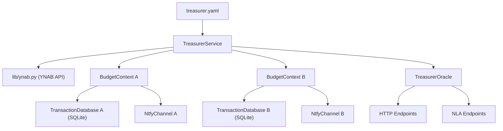

# Treasurer — Budget & Spending Analyst

Treasurer integrates with the YNAB (You Need A Budget) API to sync transactions, store them locally, and produce spending analysis summaries. It operates on multiple budgets independently, providing both automated monthly reports and on-demand query capabilities.

## Purpose

* Sync YNAB transactions daily into local SQLite databases (one per budget)
* Expose an Oracle/NLA endpoint for querying spending summaries over arbitrary date ranges
* Automatically generate and push monthly spending reports on the 5th of each month
* Support multiple independent budgets with separate databases and notification channels

## Architecture

Treasurer follows the standard DImROD Service + Oracle pattern:

* `TreasurerService` runs the main loop (daily sync + monthly auto-trigger detection)
* `TreasurerOracle` exposes HTTP and NLA endpoints for on-demand summary queries
* `TransactionDatabase` wraps `lib/db.py`'s `Database` class for transaction persistence (one instance per budget)
* `lib/ynab.py` handles all YNAB API communication



On startup, the service:

1. Parses the config file into `TreasurerConfig`
2. Initializes the `YNAB` client with the configured access token
3. For each configured budget, creates a `BudgetContext` containing:
   - A `TransactionDatabase` instance pointed at the budget's `db_path`
   - An `NtfyChannel` instance for the budget's `ntfy_topic`
   - Metadata (budget_id, name)
4. Starts the Oracle thread
5. Enters the main service loop

## File/Module Structure

```
services/treasurer/
├── treasurer.py          # Main service file: TreasurerConfig, TreasurerService, TreasurerOracle
├── db.py                 # TransactionDatabase, SummaryDatabase classes and schemas
└── treasurer.yaml        # Config file (deployment instance; not committed)
```

### `treasurer.py`

Contains:
- `TreasurerBudgetConfig` — Config class for a single budget definition
- `TreasurerConfig` — Main service config extending `ServiceConfig`
- `BudgetContext` — Runtime object grouping a budget's DB, ntfy channel, and metadata
- `TreasurerService` — Main service class extending `Service`
- `TreasurerOracle` — Oracle class extending `Oracle`

### `db.py`

Contains:
- `TransactionDatabaseConfig` — extends `DatabaseConfig`
- `TransactionDatabase` — extends `Database`, manages `transactions` and `summaries` tables
- Helper functions for SQL query building

## Configuration Schema (YAML)

```yaml
service_name: treasurer
service_log: stdout
msghub_name: YOUR_MSGHUB_NAME
oracle:
  addr: 0.0.0.0
  port: 2370
  log: stdout
  auth_cookie: treasurer_auth
  auth_secret: YOUR_JWT_SECRET_HERE
  auth_users:
  - username: budget_user
    password: budget_pass
    privilege: 0

ynab:
  access_token: YOUR_YNAB_ACCESS_TOKEN

budgets:
- budget_id: "aaaaaaaa-bbbb-cccc-dddd-eeeeeeeeeeee"
  name: "Personal Budget"
  db_path: "./.treasurer_personal.db"
  ntfy_topic: "dimrod-treasurer-personal"
- budget_id: "ffffffff-1111-2222-3333-444444444444"
  name: "Household Budget"
  db_path: "./.treasurer_household.db"
  ntfy_topic: "dimrod-treasurer-household"

sync_hour: 3
```

### Config Fields

**`TreasurerConfig`** extends `ServiceConfig`:

| Field | Type | Required | Default | Description |
|-------|------|----------|---------|-------------|
| `ynab` | `YNABConfig` | Yes | — | YNAB API credentials (access_token) |
| `budgets` | `list[TreasurerBudgetConfig]` | Yes | — | List of budget definitions |
| `sync_hour` | `int` | No | `3` | Hour of the day (0–23) to run the daily sync |

**`TreasurerBudgetConfig`** extends `Config`:

| Field | Type | Required | Default | Description |
|-------|------|----------|---------|-------------|
| `budget_id` | `str` | Yes | — | YNAB budget UUID |
| `name` | `str` | Yes | — | Human-readable budget name |
| `db_path` | `str` | Yes | — | Path to this budget's SQLite database file |
| `ntfy_topic` | `str` | Yes | — | ntfy.sh topic for this budget's notifications |

## Database Schema

Each budget has its own SQLite database file containing two tables.

### `transactions` Table

| Column | Type | Constraints | Description |
|--------|------|-------------|-------------|
| `id` | `TEXT` | `PRIMARY KEY` | YNAB transaction ID |
| `date` | `TEXT` | `NOT NULL` | Transaction date (YYYY-MM-DD) |
| `amount` | `REAL` | `NOT NULL` | Amount in currency units (negative = outflow, positive = inflow) |
| `payee_name` | `TEXT` | | Payee/merchant name |
| `category_id` | `TEXT` | | YNAB category UUID |
| `category_name` | `TEXT` | | Human-readable category name |
| `account_name` | `TEXT` | | Account the transaction belongs to |
| `memo` | `TEXT` | | Transaction memo/description |
| `approved` | `INTEGER` | | Whether the transaction is approved (0/1) |
| `cleared` | `TEXT` | | Cleared status (cleared/uncleared/reconciled) |
| `synced_at` | `TEXT` | `NOT NULL` | ISO 8601 timestamp of when this record was last synced |

**Indexes:**
- `idx_transactions_date` on `date` — for efficient date-range queries
- `idx_transactions_category` on `category_name` — for efficient category breakdowns

### `summaries` Table

| Column | Type | Constraints | Description |
|--------|------|-------------|-------------|
| `id` | `TEXT` | `PRIMARY KEY` | SHA-256 hash of budget_id + start_date + end_date |
| `budget_id` | `TEXT` | `NOT NULL` | YNAB budget UUID |
| `start_date` | `TEXT` | `NOT NULL` | Summary period start (YYYY-MM-DD) |
| `end_date` | `TEXT` | `NOT NULL` | Summary period end (YYYY-MM-DD) |
| `total_expenses` | `REAL` | `NOT NULL` | Sum of all negative amounts (stored as positive number) |
| `total_income` | `REAL` | `NOT NULL` | Sum of all positive amounts |
| `category_breakdown` | `TEXT` | `NOT NULL` | JSON object: {"category_name": total_amount, ...} |
| `generated_at` | `TEXT` | `NOT NULL` | ISO 8601 timestamp of when summary was generated |

### `sync_state` Table

| Column | Type | Constraints | Description |
|--------|------|-------------|-------------|
| `key` | `TEXT` | `PRIMARY KEY` | State key (e.g., `"last_sync_date"`) |
| `value` | `TEXT` | `NOT NULL` | State value |

Used to track `last_sync_date` so that subsequent syncs only fetch transactions since the last successful sync.

## Service Loop Logic

The service main loop runs continuously with a sleep interval (e.g., 60 seconds between checks).

### Daily Transaction Sync

```
Every iteration of the main loop:
  1. Check current time
  2. If current hour == sync_hour AND not already synced today:
     For each budget in config.budgets:
       a. Read last_sync_date from sync_state table
       b. Call ynab.get_transactions(budget_id, since_date=last_sync_date)
       c. For each returned YNABTransactionInfo:
          - Resolve category_name via ynab.get_categories() (cached)
          - INSERT OR REPLACE into transactions table
       d. Update last_sync_date in sync_state to today
       e. Log success/failure
     Mark today as synced (in-memory flag, resets at midnight)
```

### Monthly Auto-Trigger (5th of Month)

```
Every iteration of the main loop:
  1. Check current date
  2. If day == 5 AND not already triggered this month:
     For each budget in config.budgets:
       a. Calculate previous month's date range:
          - start_date = first day of previous month
          - end_date = last day of previous month
       b. Call self.generate_summary(budget, start_date, end_date)
       c. Store summary in summaries table
       d. Format summary as human-readable message
       e. Send via budget's NtfyChannel
     Mark this month as triggered (in-memory flag, resets on new month)
```

### Loop Pseudocode

```python
def run(self):
    last_sync_day = None
    last_trigger_month = None

    while True:
        now = datetime.now()

        # Daily sync check
        if now.hour == self.config.sync_hour and last_sync_day != now.date():
            self.sync_all_budgets()
            last_sync_day = now.date()

        # Monthly trigger check (5th of month)
        if now.day == 5 and last_trigger_month != (now.year, now.month):
            self.trigger_monthly_summaries()
            last_trigger_month = (now.year, now.month)

        time.sleep(60)
```

## Oracle/NLA Endpoint Definitions

### HTTP Endpoints

#### `GET /summary`

Returns a spending summary for a budget over a date range.

* **Authentication:** Required
* **Request fields:**

| Field | Required | Type | Description |
|-------|----------|------|-------------|
| `budget_name` | Yes* | `str` | Human-readable budget name (case-insensitive match) |
| `budget_id` | Yes* | `str` | YNAB budget UUID |
| `start_date` | Yes | `str` | Start of range (YYYY-MM-DD, inclusive) |
| `end_date` | Yes | `str` | End of range (YYYY-MM-DD, inclusive) |

\*One of `budget_name` or `budget_id` must be provided. If both are given, `budget_id` takes precedence.

* **Response (200):**

```json
{
  "success": true,
  "message": "Summary generated.",
  "payload": {
    "budget_name": "Personal Budget",
    "start_date": "2025-01-01",
    "end_date": "2025-01-31",
    "total_expenses": 3245.67,
    "total_income": 5200.00,
    "net": 1954.33,
    "categories": {
      "Groceries": -845.23,
      "Rent/Mortgage": -1500.00,
      "Restaurants": -312.44,
      "Transportation": -188.00,
      "Utilities": -400.00
    },
    "transaction_count": 87
  }
}
```

* **Error (400):** Missing required fields or invalid date format
* **Error (404):** Budget not found

#### `GET /budgets`

Returns a list of all configured budgets.

* **Authentication:** Required
* **Response (200):**

```json
{
  "success": true,
  "payload": {
    "budgets": [
      {"budget_id": "aaaa...", "name": "Personal Budget"},
      {"budget_id": "ffff...", "name": "Household Budget"}
    ]
  }
}
```

#### `POST /sync`

Manually triggers a transaction sync for one or all budgets.

* **Authentication:** Required
* **Request fields:**

| Field | Required | Type | Description |
|-------|----------|------|-------------|
| `budget_name` | No | `str` | Sync a specific budget (by name) |
| `budget_id` | No | `str` | Sync a specific budget (by ID) |

If neither field is provided, all budgets are synced.

* **Response (200):**

```json
{
  "success": true,
  "message": "Synced 142 transactions for 'Personal Budget'."
}
```

#### `GET /summaries`

Returns stored historical summaries for a budget.

* **Authentication:** Required
* **Request fields:**

| Field | Required | Type | Description |
|-------|----------|------|-------------|
| `budget_name` | Yes* | `str` | Budget name |
| `budget_id` | Yes* | `str` | Budget UUID |
| `limit` | No | `int` | Max summaries to return (default: 12) |

* **Response (200):**

```json
{
  "success": true,
  "payload": {
    "summaries": [
      {
        "start_date": "2025-01-01",
        "end_date": "2025-01-31",
        "total_expenses": 3245.67,
        "total_income": 5200.00,
        "category_breakdown": {"Groceries": -845.23, "...": "..."},
        "generated_at": "2025-02-05T03:15:22Z"
      }
    ]
  }
}
```

### NLA Endpoints

#### `spending_summary`

* **Name:** `spending_summary`
* **Description:** "Get a spending summary for a budget over a date range. Specify the budget name and date range."
* **Handler behavior:**
  1. Parse `budget_name` from the NLA message (substring match against configured budget names)
  2. Extract date range from `extra_params` or parse from natural language (e.g., "last month", "January 2025")
  3. Call the internal `generate_summary()` method
  4. Return an `NLAResult` with the formatted summary

* **NLAResult response:**

```json
{
  "success": true,
  "message": "Personal Budget spending from 2025-01-01 to 2025-01-31: $3,245.67 out, $5,200.00 in. Top categories: Groceries ($845.23), Rent ($1,500.00), Restaurants ($312.44).",
  "message_context": "spending summary",
  "payload": {
    "total_expenses": 3245.67,
    "total_income": 5200.00,
    "categories": {"Groceries": -845.23, "...": "..."}
  }
}
```

#### `list_budgets`

* **Name:** `list_budgets`
* **Description:** "List all configured budgets that can be queried for spending data."
* **Handler behavior:** Return the names and IDs of all configured budgets.

## Key Class and Function Signatures

### `TreasurerBudgetConfig(Config)`

```python
class TreasurerBudgetConfig(Config):
    fields = [
        ConfigField("budget_id",   [str], required=True),
        ConfigField("name",        [str], required=True),
        ConfigField("db_path",     [str], required=True),
        ConfigField("ntfy_topic",  [str], required=True),
    ]
```

### `TreasurerConfig(ServiceConfig)`

```python
class TreasurerConfig(ServiceConfig):
    fields = ServiceConfig.fields + [
        ConfigField("ynab",       [YNABConfig],               required=True),
        ConfigField("budgets",    [list],                     required=True),
        ConfigField("sync_hour",  [int],                      required=False, default=3),
    ]
```

### `BudgetContext`

```python
class BudgetContext:
    """Runtime container for a single budget's resources."""
    def __init__(self, config: TreasurerBudgetConfig):
        self.config = config
        self.db = TransactionDatabase(...)       # initialized from config.db_path
        self.ntfy = NtfyChannel(config.ntfy_topic)
        self.category_cache = {}                  # category_id -> category_name
```

### `TransactionDatabase(Database)`

```python
class TransactionDatabase(Database):
    TABLE_TRANSACTIONS = "transactions"
    TABLE_SUMMARIES = "summaries"
    TABLE_SYNC_STATE = "sync_state"

    def init_tables(self) -> None: ...
    def upsert_transaction(self, txn_data: dict) -> None: ...
    def upsert_transactions_batch(self, txn_list: list[dict]) -> None: ...
    def get_transactions_in_range(self, start_date: str, end_date: str) -> list[tuple]: ...
    def get_last_sync_date(self) -> str | None: ...
    def set_last_sync_date(self, date_str: str) -> None: ...
    def save_summary(self, summary: dict) -> None: ...
    def get_summaries(self, limit: int = 12) -> list[tuple]: ...
```

### `TreasurerService(Service)`

```python
class TreasurerService(Service):
    def __init__(self, config_path: str): ...
    def run(self) -> None: ...                          # Main loop

    # Core operations
    def sync_budget(self, ctx: BudgetContext) -> int: ...          # Returns count of synced txns
    def sync_all_budgets(self) -> None: ...
    def generate_summary(self, ctx: BudgetContext, start_date: str, end_date: str) -> dict: ...
    def trigger_monthly_summaries(self) -> None: ...

    # Budget lookup
    def find_budget_by_name(self, name: str) -> BudgetContext | None: ...
    def find_budget_by_id(self, budget_id: str) -> BudgetContext | None: ...
    def resolve_budget(self, budget_name: str = None, budget_id: str = None) -> BudgetContext | None: ...

    # Category resolution
    def resolve_category_name(self, ctx: BudgetContext, category_id: str) -> str: ...
```

### `TreasurerOracle(Oracle)`

```python
class TreasurerOracle(Oracle):
    def __init__(self, config: OracleConfig, service: TreasurerService): ...
    def init_endpoints(self) -> None: ...     # Registers HTTP routes
    def init_nla(self) -> None: ...           # Registers NLA handlers

    # Endpoint handlers
    def endpoint_get_summary(self) -> flask.Response: ...
    def endpoint_get_budgets(self) -> flask.Response: ...
    def endpoint_post_sync(self) -> flask.Response: ...
    def endpoint_get_summaries(self) -> flask.Response: ...

    # NLA handlers
    def nla_spending_summary(self, oracle: Oracle, params: dict) -> dict: ...
    def nla_list_budgets(self, oracle: Oracle, params: dict) -> dict: ...
```

## Interaction Flows

### Daily Sync Flow

```
┌─────────────┐    ┌──────────────┐    ┌──────────┐    ┌────────────────┐
│ Main Loop   │───▶│ sync_budget()│───▶│ YNAB API │───▶│ TransactionDB  │
│ (hour check)│    │              │    │          │    │ (upsert batch) │
└─────────────┘    └──────────────┘    └──────────┘    └────────────────┘
                          │
                          ▼
                   ┌──────────────┐
                   │ Update       │
                   │ last_sync    │
                   └──────────────┘
```

### Monthly Report Flow

```
┌─────────────┐    ┌───────────────────┐    ┌────────────────┐    ┌──────────────┐
│ Main Loop   │───▶│ generate_summary()│───▶│ TransactionDB  │───▶│ Save summary │
│ (day check) │    │                   │    │ (date query)   │    │ to summaries │
└─────────────┘    └───────────────────┘    └────────────────┘    └──────────────┘
                          │
                          ▼
                   ┌──────────────┐
                   │ ntfy_send()  │
                   │ (push notif) │
                   └──────────────┘
```

### On-Demand Summary Flow (Oracle)

```
┌──────────┐    ┌───────────────┐    ┌───────────────────┐    ┌────────────────┐
│ HTTP GET │───▶│ TreasurerOracle│───▶│ TreasurerService  │───▶│ TransactionDB  │
│ /summary │    │ (auth + parse)│    │ generate_summary()│    │ (query)        │
└──────────┘    └───────────────┘    └───────────────────┘    └────────────────┘
                                            │
                                            ▼
                                     ┌──────────────┐
                                     │ JSON Response│
                                     └──────────────┘
```

## Error Handling and Edge Cases

### YNAB API Errors

- **Rate limiting:** YNAB API has a 200 requests/hour limit. The daily sync should batch operations and use `since_date` to minimize calls. If rate-limited, log the error and retry on the next loop iteration.
- **Auth failures:** If the access token is invalid/expired, log the error, send an ntfy alert to the service's main `msghub_name`, and skip the sync cycle.
- **Network errors:** Wrap all YNAB API calls in try/except. On transient failures, log and retry next cycle. Do NOT update `last_sync_date` on failure.

### Database Errors

- **Table initialization:** Call `init_tables()` on startup and on every database access attempt (idempotent CREATE TABLE IF NOT EXISTS).
- **Concurrent access:** SQLite is single-writer. The service loop and Oracle endpoints both access the DB. Use the service's `self.lock` (inherited from `Service`) to serialize DB writes. Reads can proceed without locking (SQLite WAL mode recommended).
- **Corrupt database:** If a DB error occurs, log it and continue with other budgets.

### Edge Cases

- **First run (no last_sync_date):** When `last_sync_date` is None, perform a full sync (YNAB returns all transactions). This may be slow for large budgets but only happens once.
- **Budget removed from config:** Orphaned DB files are left in place (no destructive action). The service simply stops operating on that budget.
- **Duplicate transactions:** YNAB transaction IDs are stable. Using `INSERT OR REPLACE` with the transaction ID as primary key handles duplicates naturally.
- **Split transactions:** YNAB splits a transaction into sub-transactions with different categories. Each sub-transaction has its own ID and should be stored as an independent row.
- **Transfer transactions:** Transfers between accounts show up as two transactions (one positive, one negative). These should be stored as-is; the summary logic can optionally filter transfers if a category like "Transfer" is detected.
- **Category changes:** If a user re-categorizes a transaction in YNAB, the next sync (which uses `since_date`) will return the updated transaction, and `INSERT OR REPLACE` will overwrite the old row.
- **Month boundary for monthly trigger:** The 5th-of-month trigger uses an in-memory flag `(year, month)` to prevent duplicate triggers. If the service restarts on the 5th after already triggering, it will re-trigger. To prevent this, check the `summaries` table for an existing summary covering the previous month before generating a new one.

### Notification Formatting

Monthly summary notifications should be formatted as Markdown for readability:

```markdown
## 📊 Personal Budget — January 2025

**Income:** $5,200.00
**Expenses:** $3,245.67
**Net:** +$1,954.33

### Top Categories
| Category | Amount |
|----------|--------|
| Rent/Mortgage | $1,500.00 |
| Groceries | $845.23 |
| Restaurants | $312.44 |
| Utilities | $400.00 |
| Transportation | $188.00 |
```

## Future Extension Points

1. **Category budgets/targets:** Extend the summary to compare actual spending against YNAB category targets (available via the YNAB API's `get_categories` which includes `budgeted` amounts).

2. **Trend analysis:** With historical summaries stored, add an endpoint that compares month-over-month or year-over-year spending trends per category.

3. **Anomaly detection:** Flag unusual spending patterns (e.g., a category exceeding 2x its rolling average) and send proactive ntfy alerts.

4. **Custom report periods:** Support weekly or bi-weekly summaries in addition to monthly, configurable per budget.

5. **Account-level breakdown:** Add account filtering to the summary endpoint so users can analyze spending by account (e.g., credit card vs. checking).

6. **Inter-service integration:** Expose data to other DImROD services (e.g., Telegram bot commands like `/budget` for quick spending checks, or Speaker NLA for voice queries).

7. **Export endpoint:** Add an endpoint that exports transaction data or summaries to Excel (using the existing `export_to_excel()` from `lib/db.py`).

8. **Configurable sync frequency:** Allow more frequent syncing (e.g., every 6 hours) for users who want near-real-time data, while respecting YNAB rate limits.

9. **Transaction search endpoint:** Add a `/transactions` endpoint supporting filters (payee, category, amount range, date range) for ad-hoc queries.

10. **Multi-currency support:** If YNAB budgets use different currencies, store and display currency codes alongside amounts.

## Dependencies

* **Library modules:** `lib.service`, `lib.oracle`, `lib.config`, `lib.nla`, `lib.db`, `lib.ynab`, `lib.ntfy`, `lib.log`
* **Python standard library:** `datetime`, `time`, `json`, `hashlib`, `calendar`
* **External packages:** `ynab` (YNAB Python SDK), `flask`, `gevent`
* **External APIs:** YNAB API (via access token)
* **Other services:** None (Treasurer is queried by Speaker/Telegram, not the other way around)
